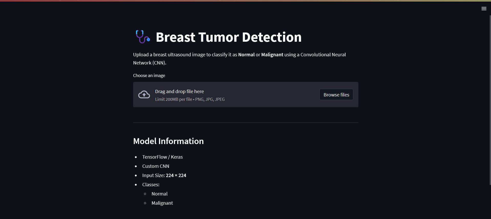

# 🩺 Breast Tumor Detection using CNN

A Deep Learning project that classifies **breast ultrasound images** into **Normal** or **Malignant** using a Convolutional Neural Network (CNN) built with TensorFlow.


---

## Application


 

---

## Features

- CNN built from scratch using TensorFlow/Keras
- Binary image classification
- Automatic image preprocessing
- Interactive Streamlit interface
- Confidence score prediction
- Model saved after training
- Classification report generation
- Confusion matrix generation

---

## 📂 Project Structure

```text
Breast-Tumor-Detection
│
├── app.py
├── README.md
├── requirements.txt
├── .gitignore
│
├── data
│   ├── train
│   │   ├── normal
│   │   └── malignant
│   └── test
│
├── models
│   ├── cnn_model.keras
│   └── metrics.json
│
└── src
    ├── __init__.py
    ├── data_loader.py
    ├── model.py
    ├── predict.py
    └── train.py
```

---

## Installation

Clone the repository

```bash
git clone https://github.com/yasminebounasla/Breast-Tumor-Detection.git

cd Breast-Tumor-Detection
```

Install dependencies

```bash
pip install -r requirements.txt
```

---

##  Train the model

```bash
python -m src.train
```

or

```bash
python -m src.train --data data/train
```

The trained model will automatically be saved inside

```text
models/
```

---

## 🌐 Run the application

```bash
streamlit run app.py
```

Open

```
http://localhost:8501
```

Upload an ultrasound image and click **Predict**.

---

## 🧠 CNN Architecture

Input (224×224×3)

↓

Conv2D (32)

↓

MaxPooling

↓

Conv2D (64)

↓

MaxPooling

↓

Conv2D (128)

↓

MaxPooling

↓

Flatten

↓

Dense (128)

↓

Dropout

↓

Sigmoid

↓

Prediction

---

## 🛠 Technologies

- Python
- TensorFlow / Keras
- NumPy
- Pillow
- Streamlit
- Scikit-Learn
- imbalanced-learn


---

## 📄 License

MIT License

---

## 👩‍💻 Author

**Yasmine Bounasla**

GitHub

https://github.com/yasminebounasla